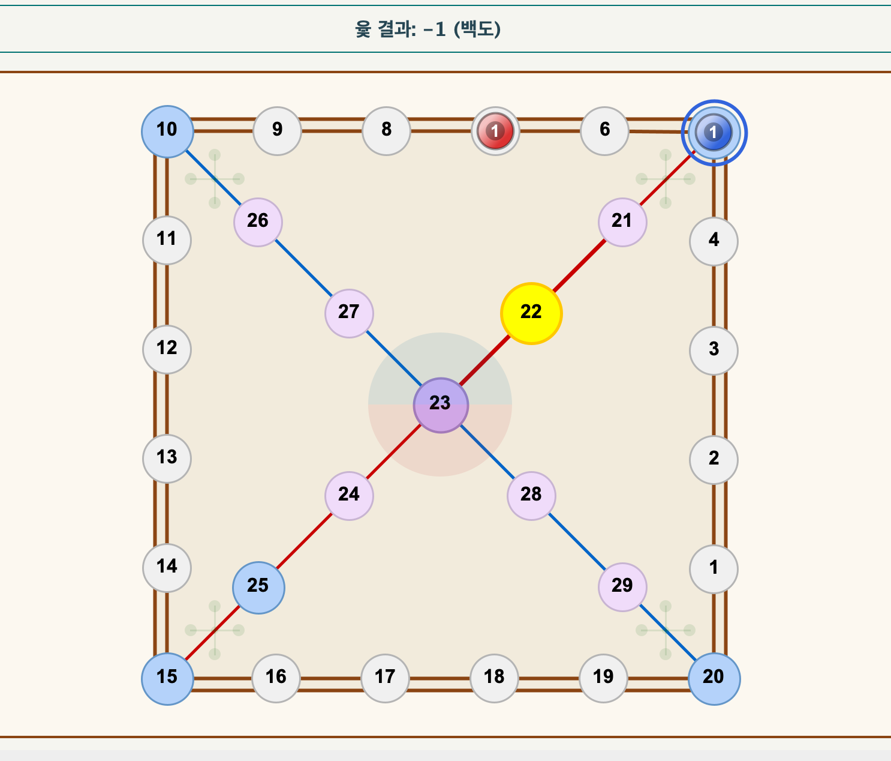

# 🎲 Yut Nori Game Project (윷놀이 게임 프로젝트)

> 전통 윷놀이 보드게임을 소프트웨어로 구현한 Java 기반 데스크탑 애플리케이션입니다. MVC 구조를 바탕으로 객체지향적 설계를 적용하였으며, Swing GUI를 통해 사용자 친화적인 인터페이스를 제공합니다.

---

## 📌 프로젝트 개요

* 🧩 주제: 전통 한국 보드게임 윷놀이의 디지털 구현
* 💻 개발 언어: Java 17
* 🎨 GUI: Java Swing
* 🏛️ 설계 구조: MVC(Model-View-Controller)
* 📄 문서: UML 클래스 다이어그램, 시퀀스 다이어그램, 상태 다이어그램 등 포함

---

## 🚀 주요 기능

| 기능 구분     | 세부 내용                            |
| --------- | -------------------------------- |
| 🎮 게임 플레이 | 윷 던지기, 말 이동, 잡기, 승리 조건 처리        |
| 👥 멀티 플레이 | 2\~4인 턴제 플레이 지원                  |
| 🖥️ UI    | 직관적인 Java Swing 기반 GUI 구현        |
| 🧠 게임 로직  | 객체지향 구조로 모델링된 플레이어, 말, 보드, 경로 구조 |
| 📈 기록 관리  | 플레이어 순서 표시 및 턴 알림                |

---

## 🧱 프로젝트 구조

```
📦src
 ┣ 📂controller
 ┃ ┗ 📜GameController.java
 ┣ 📂model
 ┃ ┣ 📜Game.java
 ┃ ┣ 📜Player.java
 ┃ ┣ 📜Piece.java
 ┃ ┣ 📜Board.java
 ┃ ┗ 📜YutSet.java
 ┣ 📂ui
 ┃ ┣ 📂swing
 ┃ ┃ ┣ 📜GameBoard.java
 ┃ ┃ ┣ 📜PlayerSelectionDialog.java
 ┃ ┃ ┗ 📜YutStickPanel.java
 ┣ 📜YutNoriApp.java
 ┗ 📜YutNoriGame.java
```

---

## 📸 시연 이미지

> 게임 진행 화면 스크린 샷



---

## 🛠️ 사용 기술 및 환경

| 구분       | 기술                       |
| -------- | ------------------------ |
| Language | Java 17                  |
| GUI      | Java Swing               |
| 구조       | MVC 구조 기반 클래스 설계         |
| 문서화      | UML (클래스/시퀀스/상태 다이어그램 등) |

---

## 🧪 실행 방법

1. Shell Script 실행
   
```click to run script
fix-compile.sh
```
   
2. 프로젝트 클론

```bash
git clone https://github.com/xyyjry/YutNori-Game.git
```

3. IDE (IntelliJ 또는 Eclipse 등)로 열기

3. Main 클래스 실행

```
YutNoriApp.java 또는 YutNoriGame.java 실행
```

---
